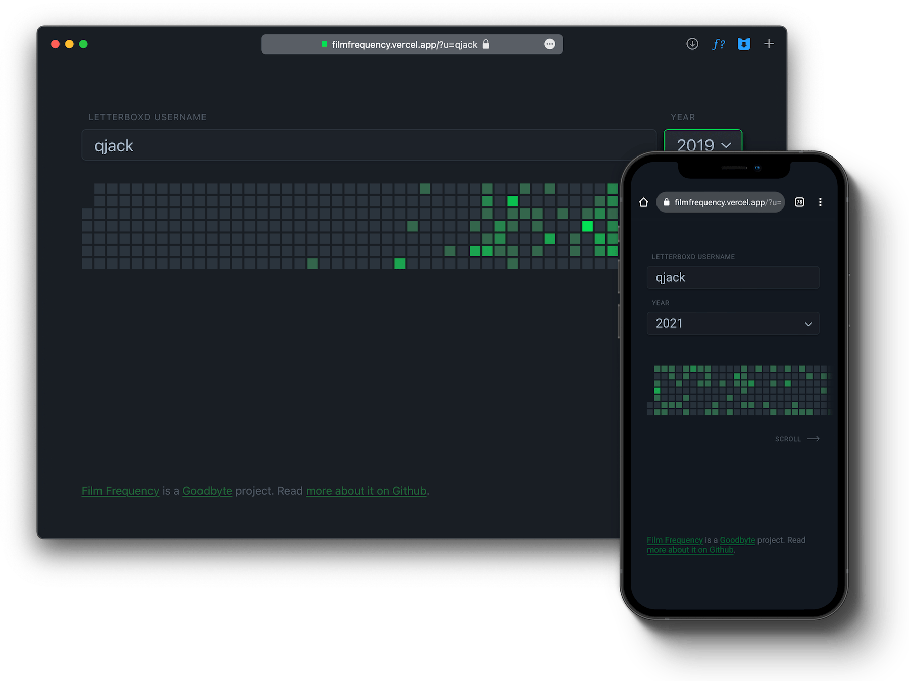

# [Film Frequency](https://filmfrequency.com)
**A contribution graph for Letterboxd**



Film Frequency generates Github-like contribution graphs based on the number of films you've logged each day. 
Just enter your Letterboxd username and select the year. Note that your Letterboxd profile must be public for
the site to work, and that only _logged_ movies are counted towards the graph.

### Operational notes

Film Frequency is written in Vue (front-end) and Go (back-end), and hosted on Vercel.

Clone the repo and install its dependencies:

```bash
yarn install
```

Run locally:
```bash
yarn serve
```
